# SnapLink AI (Katomaran)

**SnapLink AI** is a full-stack URL shortener with real-time analytics, team tools, and **Google Gemini**–powered insights — built for the Katomaran hackathon.

---

## Live application

| Environment | Link | Description |
|-------------|------|-------------|
| **Live app (Frontend)** | [**https://katomaran-eight.vercel.app**](https://katomaran-eight.vercel.app) | React SPA — signup, dashboard, AI chat, PWA |
| **API (Backend)** | [**https://katomaran-y789.onrender.com**](https://katomaran-y789.onrender.com) | Express REST + Socket.io |
| **API health** | [https://katomaran-y789.onrender.com/health](https://katomaran-y789.onrender.com/health) | Status + MongoDB connection |
| **GitHub** | [https://github.com/thangadurai27/katomaran.git](https://github.com/thangadurai27/katomaran.git) | Source code |

**Short links format:** `https://katomaran-y789.onrender.com/r/{code}`

---

## Demo video (required for hackathon review)

| Platform | Link |
|----------|------|
| **YouTube / Loom demo** | **➡️ [VIDEO LINK HERE](https://drive.google.com/file/d/1tN1Hd6fdHZSUR48sNiC9owqdgfzvfmXc/view?usp=drive_link)** |

---

## Screenshots

Here is the flow of the application:

### 1. Landing Page
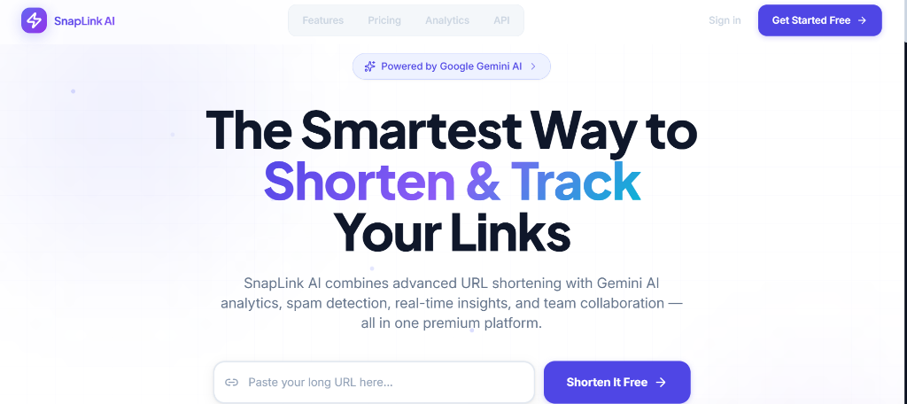

### 2. Sign Up
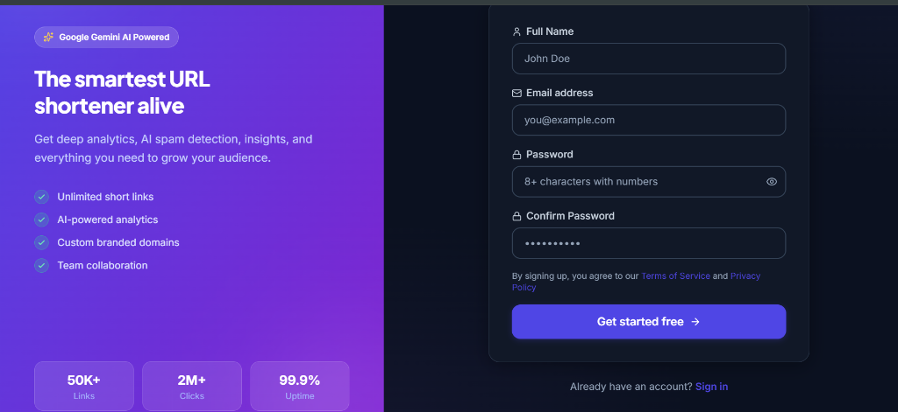

### 3. Create Short Link
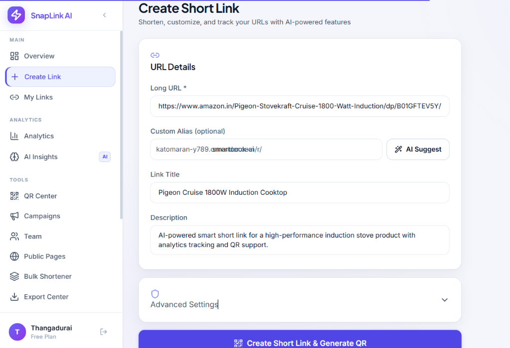

### 4. Link & QR Code Generated
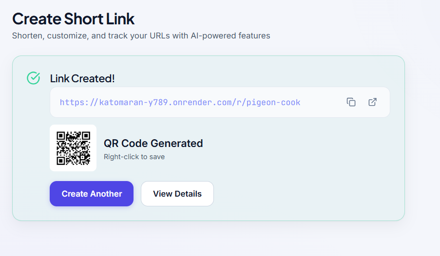

### 5. My Links Dashboard
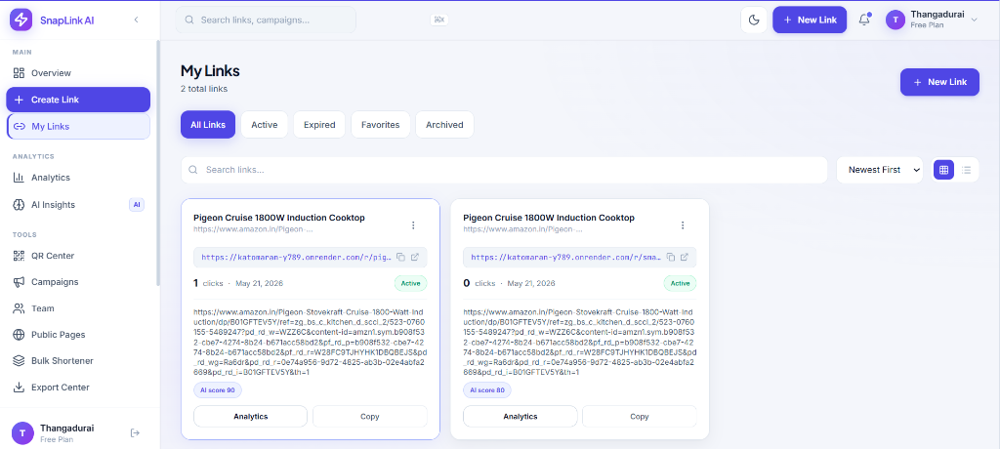

### 6. Analytics Overview
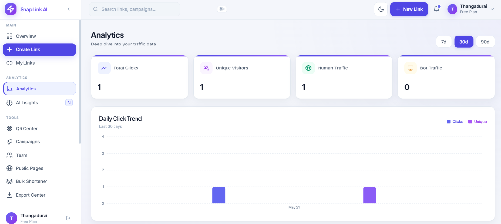

### 7. Analytics Details
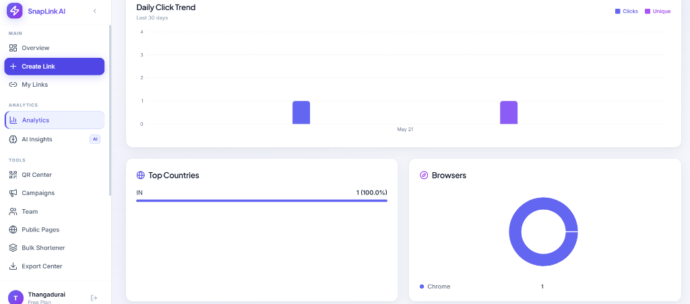

### 8. AI Insights
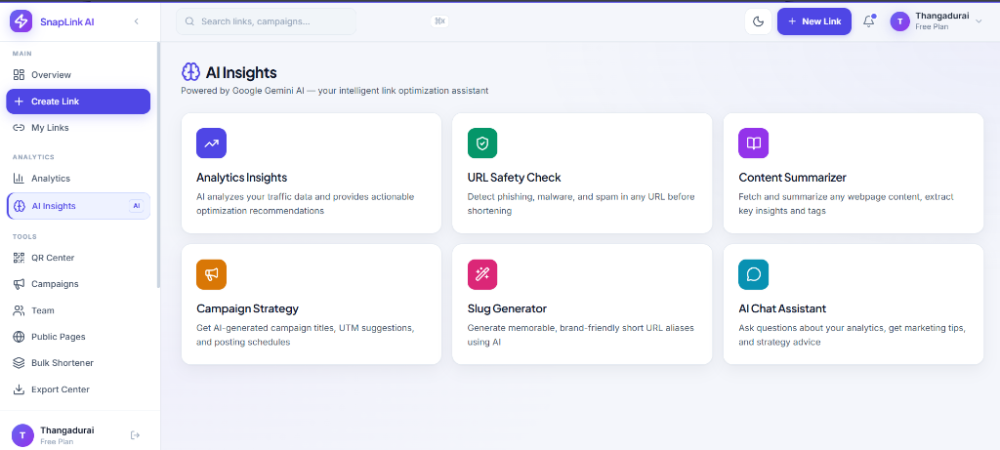

### 9. QR Center
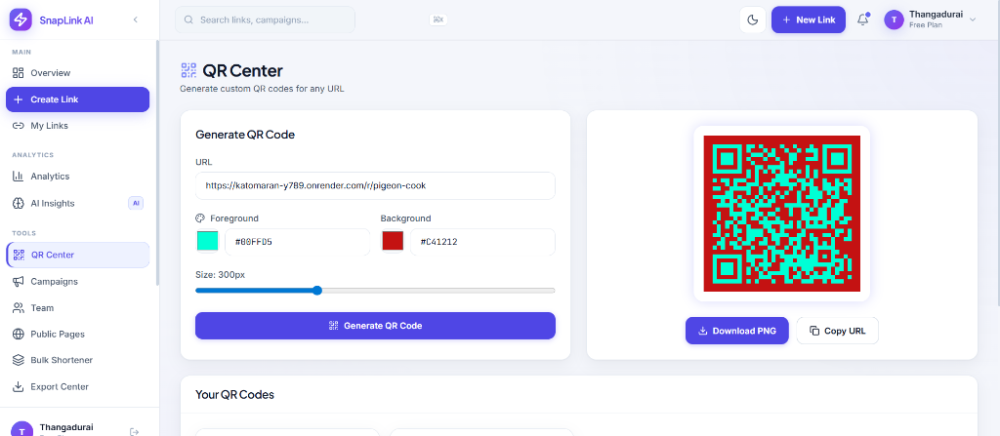

### 10. Campaigns
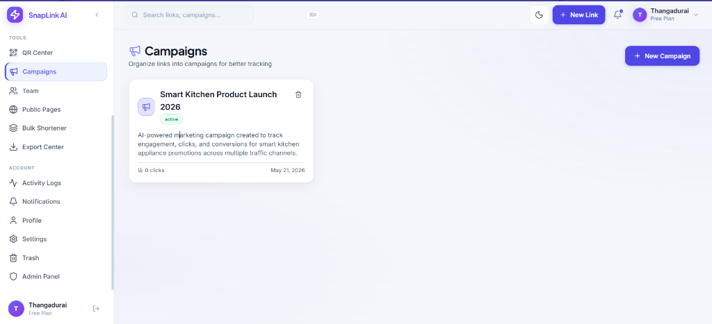

### 11. Dashboard Overview
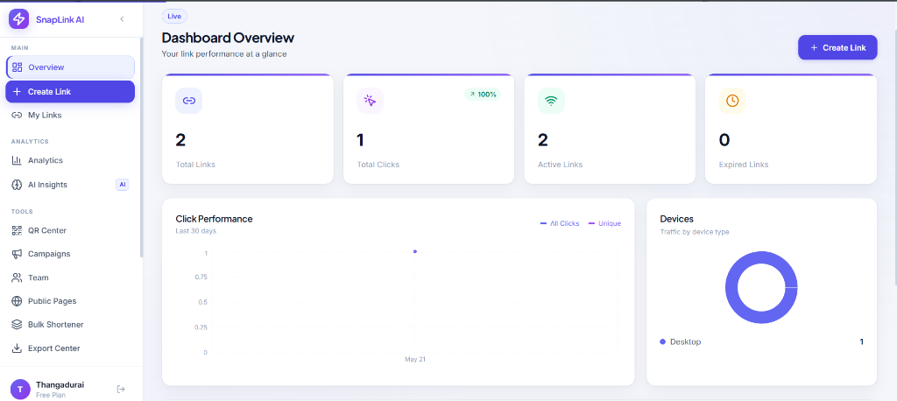

### 12. Dashboard Details
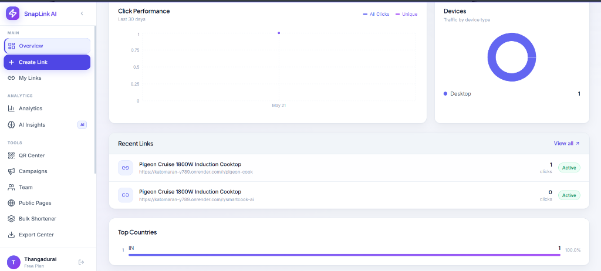

### 13. Bulk Shortener
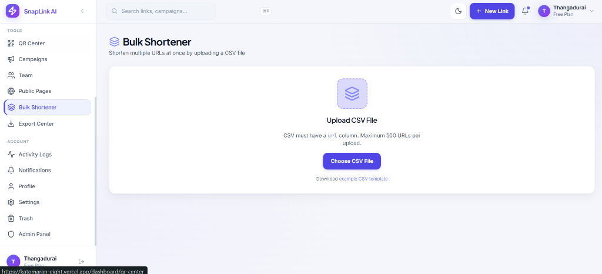

### 14. Activity Logs
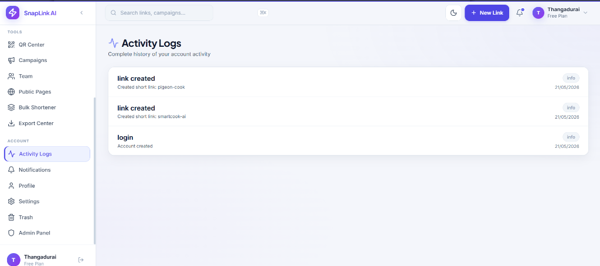

### 15. Profile Settings
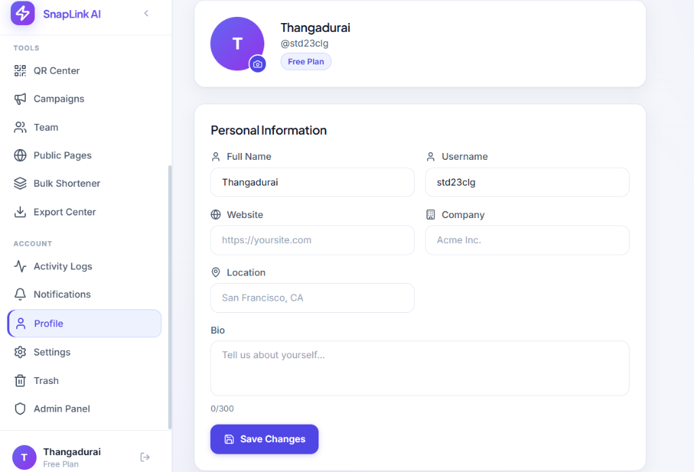

---

## Features

- URL shortening with custom aliases, passwords, expiry, and geo/device rules
- Real-time click analytics (charts, countries, devices, referrers)
- **Gemini AI:** chat assistant, spam detection, slug ideas, insights, campaign suggestions
- QR code generation, bio pages, bulk CSV import, team roles
- Mobile-first dashboard, bottom nav, PWA (installable)
- JWT auth with refresh tokens; optional email flows

---

## Tech stack

| Layer | Technologies |
|-------|----------------|
| Frontend | React 19, Vite, Tailwind CSS, Zustand, TanStack Query, Recharts, Socket.io client, PWA |
| Backend | Node.js 20, Express 5, MongoDB (Mongoose), Socket.io, JWT, Winston |
| AI | Google Gemini (`gemini-2.5-flash`) |
| Deploy | **Vercel** (frontend), **Render** (backend), **MongoDB Atlas** (database) |

---

## Repository structure

```
katomaran/
├── backend/          # Express API, models, Gemini integration
├── frontend/         # Vite React app
├── docs/
│   └── AI-PLANNING.md
├── Screenshot/       # App screenshots (01–27, demo order)
├── DEPLOY.md         # Vercel + Render + MongoDB troubleshooting
└── README.md
```

---

## Setup instructions

### Prerequisites

- **Node.js 20.x** (see `backend/.nvmrc`)
- **npm**
- **MongoDB** — local install or [MongoDB Atlas](https://www.mongodb.com/cloud/atlas) free tier
- **Gemini API key** — [Google AI Studio](https://aistudio.google.com/apikey) (optional for local AI; fallbacks exist)

### 1. Clone the repository

```bash
git clone https://github.com/thangadurai27/katomaran.git
cd katomaran
```

### 2. Backend setup

```bash
cd backend
cp .env.example .env
```

Edit `backend/.env`:

- `MONGODB_URI` — local or Atlas connection string  
- `JWT_SECRET` / `JWT_REFRESH_SECRET` — random strings  
- `GEMINI_API_KEY` — for AI features  
- `FRONTEND_URL=http://localhost:5173`

```bash
npm install
npm run dev
```

API runs at **http://localhost:5000**

### 3. Frontend setup

```bash
cd frontend
cp .env.example .env
```

Default `.env` points to local API:

```env
VITE_API_URL=http://localhost:5000/api
VITE_BASE_URL=http://localhost:5000
VITE_SHORT_URL_BASE=http://localhost:5000/r/
```

```bash
npm install
npm run dev
```

App runs at **http://localhost:5173**

### 4. Production build (optional)

```bash
cd frontend && npm run build    # output: frontend/dist
cd backend && npm start         # NODE_ENV=production
```

See [DEPLOY.md](./DEPLOY.md) for Vercel + Render environment variables.

---

## Assumptions made

1. **Single-tenant SaaS** — Users belong to one account; enterprise multi-tenancy is out of scope.
2. **Email is optional** — Signup works without SMTP; verification/reset emails need `EMAIL_*` on Render.
3. **Free-tier hosting** — Render free tier may sleep; first request after idle can be slow.
4. **MongoDB Atlas** — Production uses Atlas; password special characters must be **URL-encoded** in `MONGODB_URI` (`@` → `%40`).
5. **AI is augmentative** — Core shorten/redirect/analytics work without Gemini; AI adds insights and safety scans.
6. **CORS** — Backend allows `FRONTEND_URL` / `CLIENT_URL` and `https://katomaran-eight.vercel.app`.
7. **Short URLs** — Served from the **backend** domain (`/r/:code`), not the Vercel domain.
8. **Hackathon demo video** — Reviewers expect a YouTube or Loom link in this README (see section above).

---

## AI planning document

Full planning notes: **[docs/AI-PLANNING.md](./docs/AI-PLANNING.md)**

Summary:

- Gemini powers chat, spam scoring, slug suggestions, analytics narratives, and campaign hints.
- Prompts target **structured JSON** responses with server-side fallbacks.
- AI routes are rate-limited; secrets stay on the server only.

---

## Architecture diagram

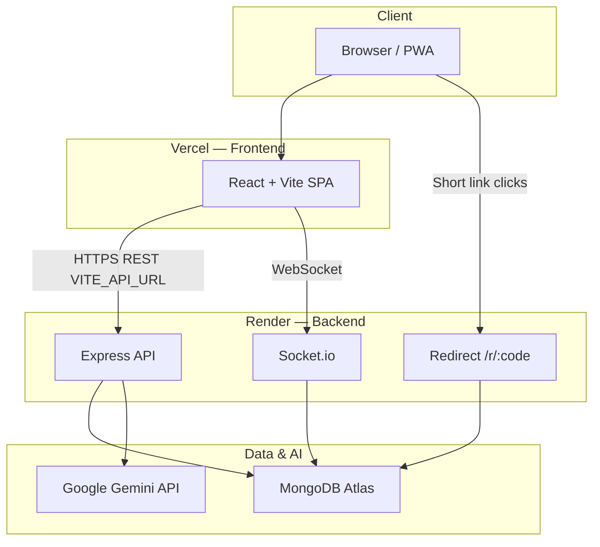

### Request flow (create link + AI scan)

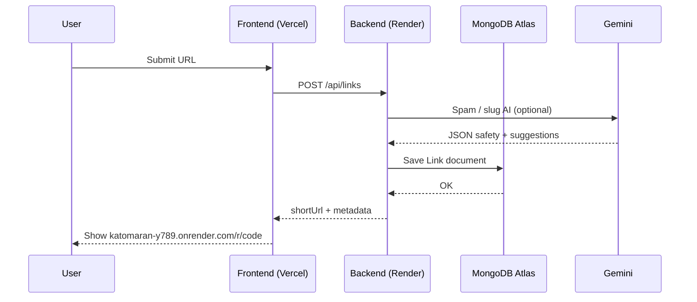

---

## Environment variables (reference)

| Location | Key files |
|----------|-----------|
| Backend local | `backend/.env.example` → `.env` |
| Frontend local | `frontend/.env.example` → `.env` |
| Frontend production | `frontend/.env.production` (Render API URLs) |
| Deploy guide | [DEPLOY.md](./DEPLOY.md) |

---

## Scripts

| Command | Where | Purpose |
|---------|-------|---------|
| `npm run dev` | `backend/` | API with nodemon |
| `npm start` | `backend/` | Production server |
| `npm run dev` | `frontend/` | Vite dev server |
| `npm run build` | `frontend/` | Production build + PWA |

---

## License

MIT

---

This project is a part of a hackathon run by [https://katomaran.com](https://katomaran.com)
